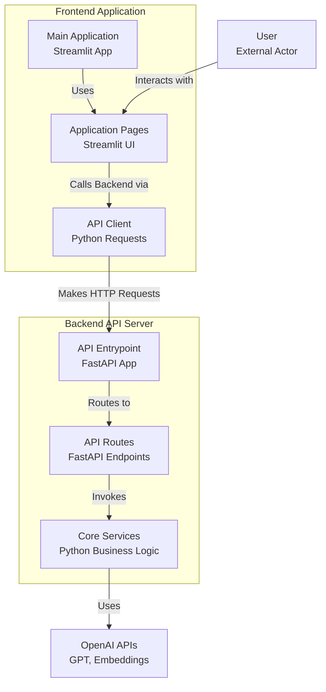

# System Architecture Diagram

```mermaid
graph TD
    719["User<br>External Actor"]
    726["OpenAI APIs<br>GPT, Embeddings"]
    
    subgraph 717["Backend API Server<br>FastAPI"]
        723["API Entrypoint<br>FastAPI App"]
        724["API Routes<br>FastAPI Endpoints"]
        725["Core Services<br>Python Business Logic"]
        723 -->|Routes to| 724
        724 -->|Invokes| 725
    end
    
    subgraph 718["Frontend Application<br>Streamlit"]
        720["Main Application<br>Streamlit App"]
        721["API Client<br>Python Requests"]
        722["Application Pages<br>Streamlit UI"]
        720 -->|Uses| 722
        722 -->|Calls Backend via| 721
    end
    
    721 -->|Makes HTTP Requests| 723
    719 -->|Interacts with| 722
    725 -->|Uses| 726
```