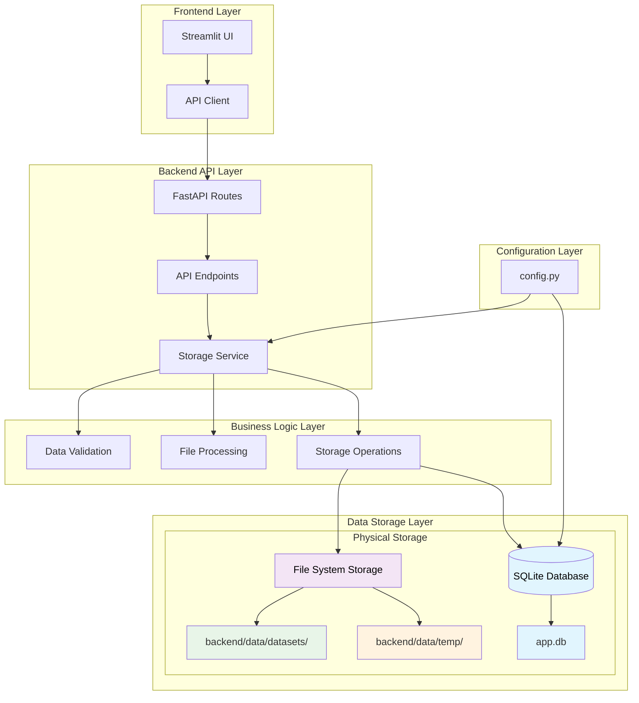
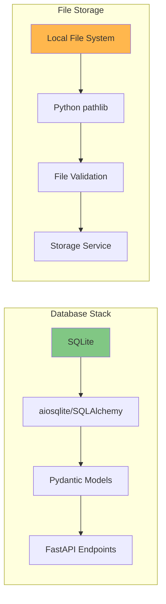
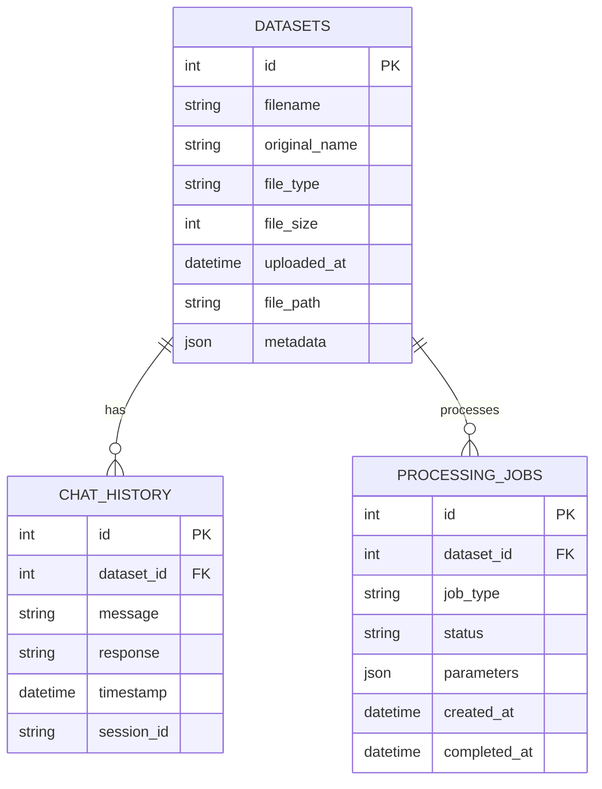
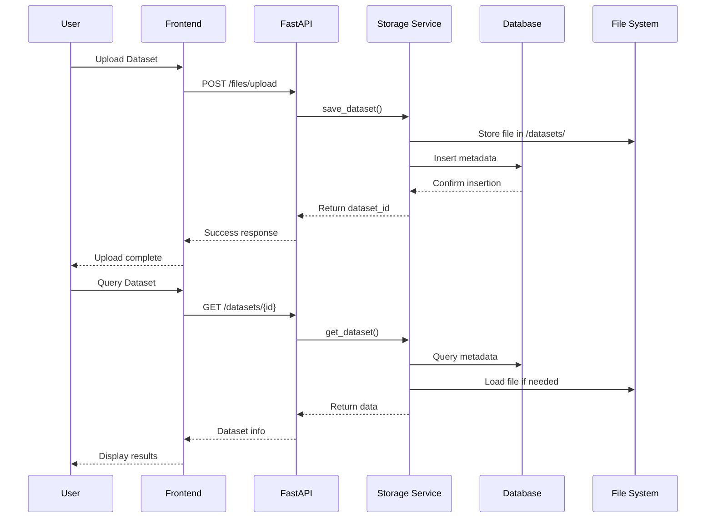
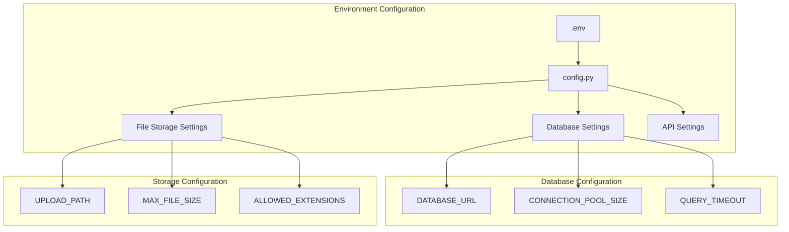

# Database Component Analysis

 In this section, I'll provide a comprehensive analysis of the database component architecture, responsibilities, and implementation details.

## Database Component Overview

The database component implemented as a **file-based storage system** rather than a traditional database server. Here's the detailed analysis:

### Architecture and Location

The database component is primarily located in:
- **`backend/data/`** - Data storage layer
  - `datasets/` - User-uploaded datasets (CSV, XLSX)
  - `temp/` - Temporary files for processing
- **`backend/app/services/`** - Business logic & storage management
- **`backend/app/config.py`** - Database configuration and connection settings

## Database Architecture Diagram

## Component Responsibilities

### 1. Storage Service (`backend/app/services/`)
- **Primary Role**: Abstracts database operations and file management
- **Responsibilities**:
  - CRUD operations for datasets
  - File upload/download handling
  - Data persistence management
  - Database connection management

### 2. Data Layer (`backend/data/`)
- **datasets/**: Persistent storage for user-uploaded files
- **temp/**: Temporary processing files and cache
- **app.db**: SQLite database file (inferred from typical FastAPI patterns)

### 3. Configuration (`backend/app/config.py`)
- Database connection strings
- File storage paths
- Upload size limits
- Environment-specific settings

## Implementation Details

### Database Technology Stack
The project structure and common FastAPI patterns:

###  Database Schema

## Data Flow Architecture

## Key Design Patterns

### 1. **Repository Pattern**
- Storage Service acts as repository
- Abstracts database operations
- Provides clean interface for data access

### 2. **File System + Database Hybrid**
- Metadata stored in database
- Large files stored in file system
- Efficient for handling datasets

### 3. **Async Operations**
- Non-blocking database operations
- Concurrent file processing
- Better performance for I/O operations

## Configuration Structure

## Summary

The database component implements a **hybrid storage architecture** combining:
- **SQLite database** for metadata and structured data
- **File system storage** for large datasets
- **Service layer abstraction** for clean separation of concerns
- **Async operations** for better performance

